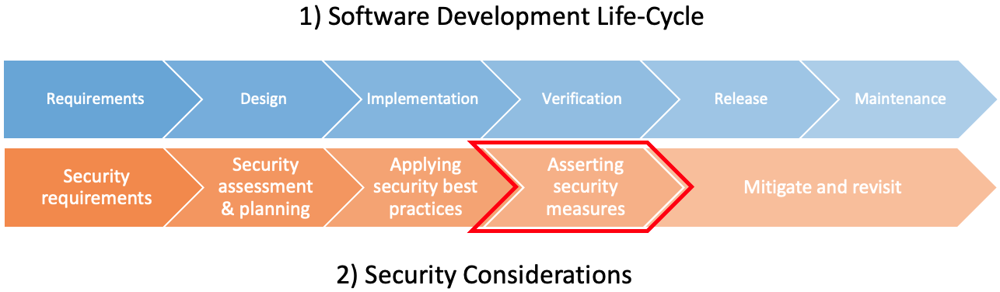

# Security testing

Software systems are susceptible to malicious attacks; the impact of such security breaches can be
[costly to businesses and their customers](https://en.wikipedia.org/wiki/List_of_data_breaches).
Security testing is a mechanism to detect security vulnerabilities to be fixed and to prevent exposure when attacked.

This document discusses security testing and provides insights on how to applying it to your software.

<!-- markdownlint-disable -->
## Why perform Security Testing?
<!-- markdownlint-restore -->

Software almost literally exists in every aspect of our lives, from entertainment to critical software that helps protect human life.
As a side-effect of its wide-spread, malicious attacks are always on the raise to exploit software systems.
Per a study done by the University of Maryland, [a cyberattack occurs every 39 seconds!](https://eng.umd.edu/news/story/study-hackers-attack-every-39-seconds)
The impact of such attacks can be costly on the business,
as they may lead to the loss of customer trust, and as a consequence, loss in revenue.
The global average cost of a data breach is [$3.9 million](https://www.ibm.com/security/digital-assets/cost-data-breach-report/#/).

Software systems need to be assessed for security vulnerabilities to protect against such attacks.

## Introduction to security testing

The key idea behind security testing is to vet a software system to detect and address security vulnerabilities as part of the software development life-cycle (SDLC).
Depending on the vulnerability, addressing it can lead to modifying the system to eliminate it. Or, it can be acknowledged with a mitigation plan in place to be executed if the vulnerability was exploited.

Security is an ongoing concern that needs to be considered throughout the SDLC of a product from inception till deprecation.
Applying this would help produce secure software more cost-effectively,
pushing the security until a later phase might be costly as it may require major re-arch and refactoring of the system.

The figure above shows what a typical SDLC looks like, the lower chart shows potential security considerations to keep in mind in each SDLC phase.

* **Requirement gathering phase:** this phase needs to assess security requirements while the product is being defined (i.e.,
[AAA](https://www.geeksforgeeks.org/computer-network-aaa-authentication-authorization-and-accounting/),
[C.I.A Triad](https://en.wikipedia.org/wiki/Information_security)).
* **Design phase:** this phase is influenced significantly by the security requirements as those
would set constraints on the design and would help guide technology choices.
The system design should be reviewed with security in mind and revised accordingly.
A common task within the design phase is [risk assessment and threat modeling](https://owasp.org/www-project-web-security-testing-guide/v41/2-Introduction/README.html#threat-modeling) to help identify risks that need to be mitigated during implementation and vetted during the verification phase.
In addition to a secure design, an outcome from this phase, is the security testing plan that describes what kind of security testing will be performed on the system.
* **Implementation phase:** the implementation of the system needs to adhere to [secure coding best practices](https://owasp.org/www-pdf-archive/OWASP_SCP_Quick_Reference_Guide_v2.pdf), this helps guard against common pitfalls and vulnerabilities upfront.
A common practice is to perform [secure code reviews](https://owasp.org/www-project-code-review-guide/) periodically to detect and eliminate issues during the implementation phase.
* **Verification phase:** this phase performs various tests to vet the software system for common attack
patterns and the identified the risks in the design phase.

* **Release and Maintenance:** security is an ongoing concern that needs to be revisited constantly to ensure that the software system is protected.

The rest of this article will focus on the tests typically performed during the implementation and verification phases.

## Performing Security Testing

The following is a list of common categories for security tests:

* **_[Manual inspection](manual-inspection.md)_**: in this category the security tester manually reviews the solution to identify potential vulnerabilities (i.e., is data being encrypted at rest and during transit, is the code following best security practices, audit the logs for sensitive data...etc) and to affirm that the risks identified are properly mitigated.
This inspection is done at different abstraction levels from high-level architecture to the low level implementation of the solution.
* **_[Vulnerability detection tools](vulnerability-detection.md)_**: this kind of testing relies on static and dynamic code analysis techniques to evaluate the software code base for common vulnerabilities or attack patterns.
* **_[Penetration testing](penetration-testing.md)_**: to affirm that the software has the right mechanisms in place to test against attackers, this kind of testing actually attacks the software with the intent of breaking through and breaching the software! If it succeeds, then it had identified a vulnerability in the system than needs to be addressed.

## Examples/Case studies

TBD

## Resources

* [Learn more about security in the security playbook](../../security/README.md).
* [A good read on how to design secure cloud solutions on Azure](https://docs.microsoft.com/en-us/azure/security/develop/secure-design)
* [Azure security documentation](https://docs.microsoft.com/en-us/azure/security/)
* [Where can I learn more about threat modeling?](https://martinfowler.com/articles/agile-threat-modelling.html#:~:text=Threat%20modelling%20is%20a%20risk,to%20build%20security%20into%20software)
* [Where can I learn more about secure coding practices?](https://docs.microsoft.com/en-us/dotnet/standard/security/secure-coding-guidelines)
* [A recommended reading from OWASP](https://owasp.org/www-project-web-security-testing-guide/v41/2-Introduction/README.html)
